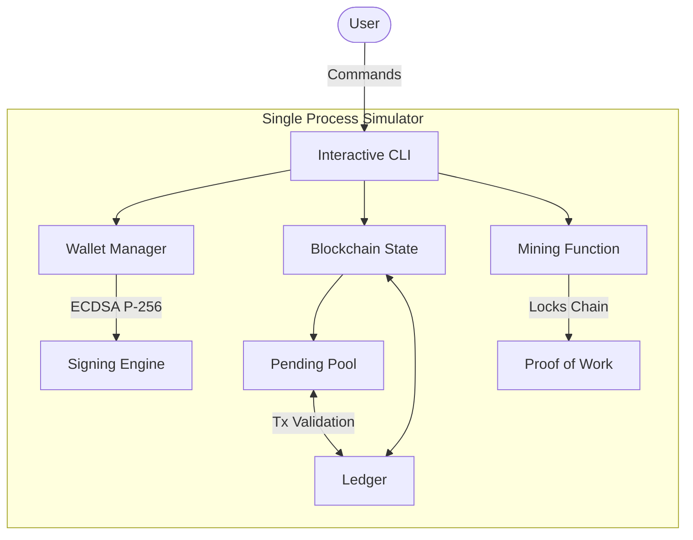
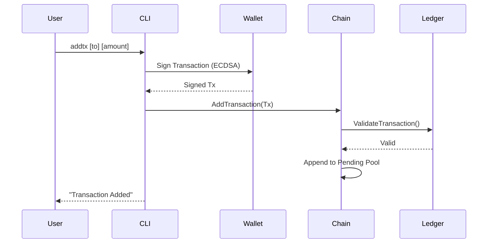
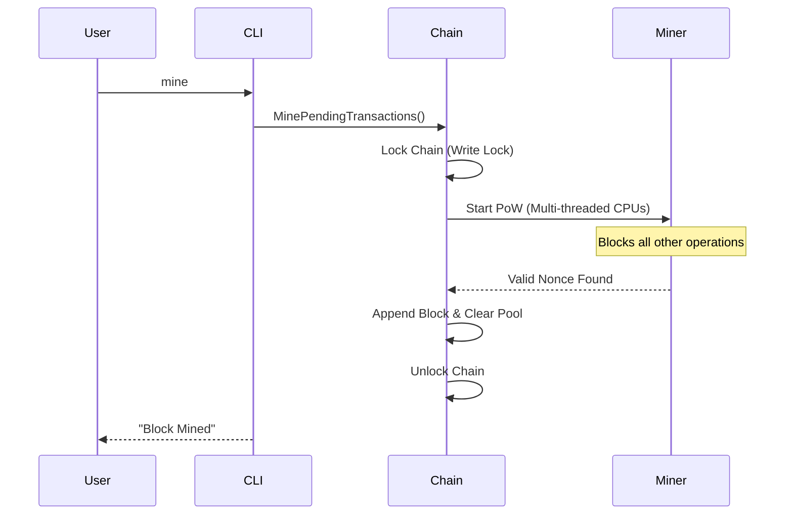

# Phase 0: Initial Architecture (Single Node Simulator)

This document describes the foundational architecture of the project before any networking or multi-process capabilities were introduced (Round 1 Codebase). At this stage, the system was a single-process blockchain simulator managed entirely through an interactive Command Line Interface (CLI).

## 1. High-Level Architecture

The entire blockchain state, memory pool (mempool), and cryptographic operations ran inside a single application.

## 2. Core Constraints of Phase 0

- **Single Process:** Everything ran in one terminal. There was no concept of peers, IP addresses, or network boundaries.
- **Cryptography:** Used **ECDSA P-256** for digital signatures with complex ASN.1/DER encoding and Low-S normalization.
- **Locking Strategy:** The `MinePendingTransactions()` function held a lock on the entire chain while computing the Proof-of-Work. Since it was a single-process simulator, this blocked the entire application until a block was found.
- **Data Persistence:** The blockchain state was saved to a single local JSON file (`data/chain.json`) when the CLI exited.

## 3. Transaction Flow (Phase 0)

Since there was no network, a transaction was instantly validated and added to the local pool.

## 4. Mining Flow (Phase 0)

Mining blocked the state because the node did not need to serve other network requests concurrently.

