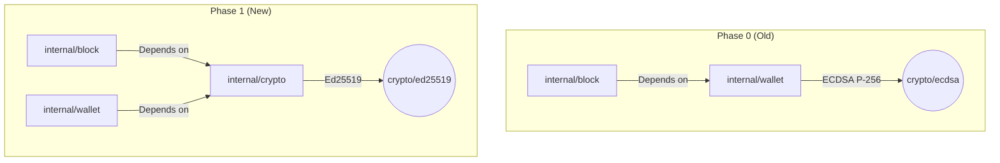
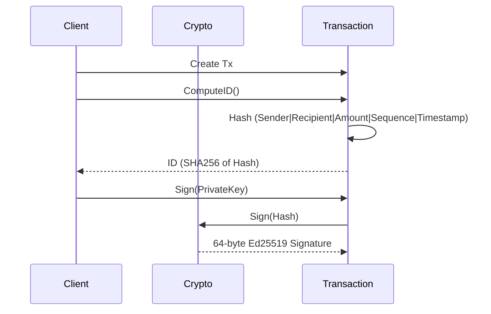

# Phase 1: Refactor, Rebrand & Ed25519 Migration

This document explains the architectural changes made during Phase 1. The goal of this phase was to transform the Round 1 codebase into a clean, rebranded foundation with modernized cryptography, preparing it for the upcoming networking layer.

## 1. Cryptographic Architecture Shift

The most significant change in Phase 1 was migrating from ECDSA P-256 to Ed25519.

### Why the Shift?
- **Simplicity:** Ed25519 does not require Low-S normalization or complex ASN.1/DER encoding.
- **Determinism:** Ed25519 signatures are deterministic.
- **Efficiency:** Fixed 32-byte public keys and 64-byte signatures are much easier to handle than variable-length ECDSA keys.

### Dependency Decoupling
In Phase 0, the block signing logic depended on the wallet package, creating bad architectural coupling. Phase 1 introduced a dedicated `internal/crypto` package.

## 2. Rebranding & Scaling

The project was rebranded to "Valence Protocol". 
- **Coin Denomination:** A new smallest unit was introduced called "Electrons" (1 VCN = 10⁹ Electrons).
- All internal structures, constants (e.g., `MiningReward`), and limits were scaled by 10⁹ to operate natively in Electrons to prevent floating-point inaccuracies.

## 3. Transaction ID Introduction

To prepare for network deduplication (Gossip Protocol in Phase 3), transactions were updated to generate a deterministic `ID`.

