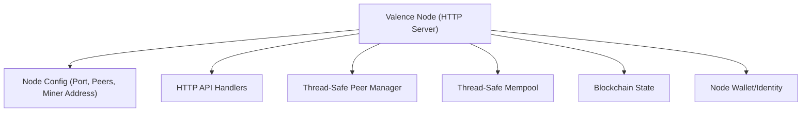
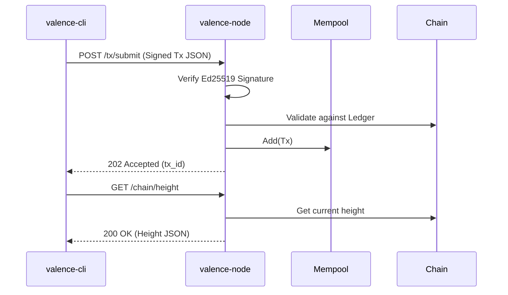
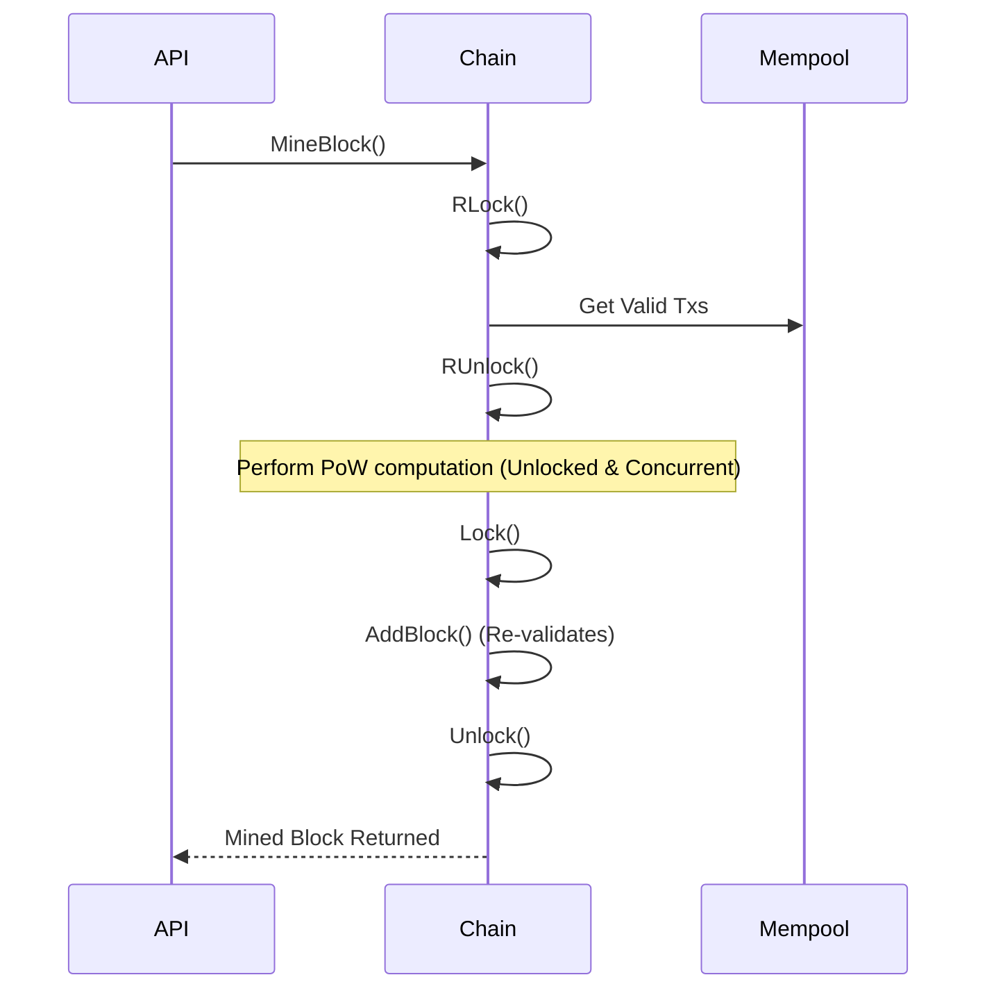

# Phase 2: HTTP Node, API & Node Identity

Phase 2 transformed the architecture from a local CLI tool into an independent HTTP service capable of interacting with external clients and other nodes.

## 1. Node Orchestration

A centralized `Node` struct (`internal/node/node.go`) was introduced to tie together all the components of the blockchain. 

## 2. Thread-Safe State Management

Because the node now serves multiple concurrent HTTP requests, state management had to become thread-safe.

### Thread-Safe Mempool
The mempool was extracted into its own struct (`internal/node/mempool.go`) guarded by an `RWMutex`. It deduplicates transactions by `tx.ID`.

### Peer Manager
A new `internal/peer/manager.go` was created to track healthy/unhealthy peers and exchange node addresses.

## 3. HTTP API Endpoints

The node exposes several endpoints for clients and future peer-to-peer communication.

## 4. Mining Concurrency Upgrade

In Phase 0, mining blocked the entire chain lock. In Phase 2, this was heavily refactored so that a node could continue serving HTTP requests (and later, gossip) while calculating the Proof-of-Work.

