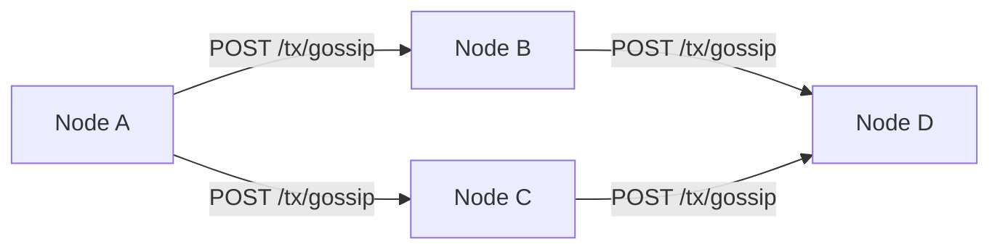
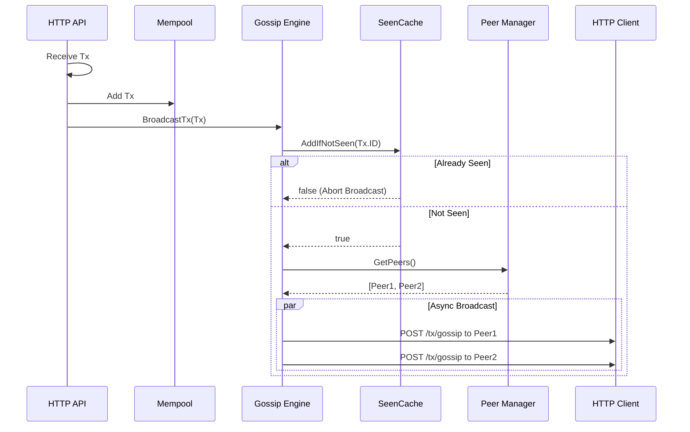
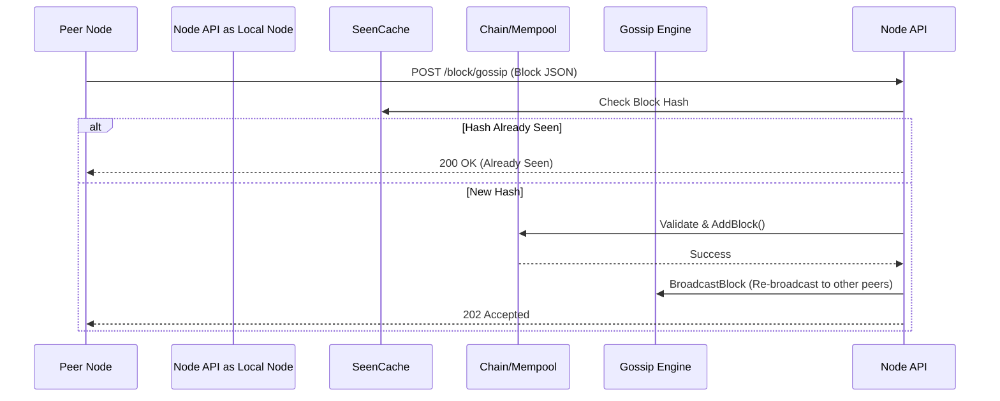

# Phase 3: Gossip Protocol

Phase 3 introduced the decentralized P2P networking layer. The Gossip Protocol allows nodes to broadcast transactions and blocks to each other efficiently without infinite routing loops.

## 1. Gossip Engine Architecture

The `Gossip Engine` (`internal/gossip/engine.go`) is responsible for communicating with peers over HTTP. 

To prevent a transaction from looping endlessly across the network, the engine utilizes a `SeenCache` (`internal/gossip/seen.go`).

## 2. Gossip Broadcast Flow

When a node receives a new transaction (via client submission) or mines a new block, it asynchronously forwards it to all known healthy peers.

## 3. Inbound Gossip Flow

When a node *receives* gossiped data from another peer, it must validate the data thoroughly.

## 4. Key Improvements in Phase 3
- **Asynchronous HTTP Calls:** Goroutines are spawned for each peer request, ensuring that one slow peer does not bottleneck the gossip engine.
- **Network Boundaries:** Signatures (Ed25519) and System transactions are strictly validated at the `/gossip` API edges before reaching the internal mempool or chain.
- **Self-Healing:** If a peer fails to respond to a gossip request, the `PeerManager` marks it as unhealthy and stops gossiping to it until it recovers.
