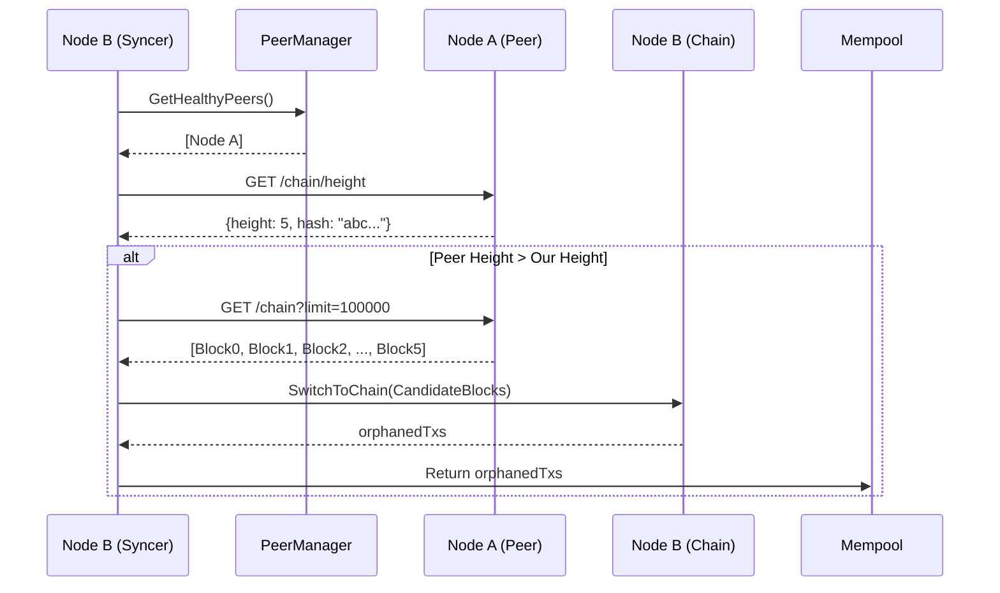
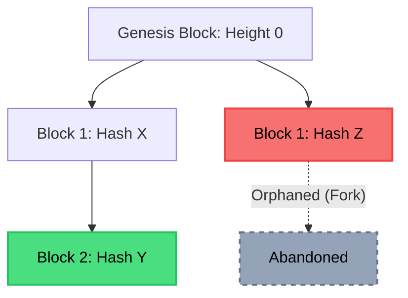

# Phase 4: Chain Sync, Fork Resolution, and Concurrency

Phase 4 introduces the necessary mechanics for new nodes to catch up to the network (Chain Sync), for the network to self-heal when two miners find blocks simultaneously (Fork Resolution), and ensures that the heavily concurrent architecture is strictly race-free.

## 1. Chain Synchronisation

The `Syncer` component (`internal/sync/syncer.go`) orchestrates the background synchronization of the blockchain. 
Nodes periodically poll their peers (every 30 seconds) to determine if they have fallen behind.

## 2. Fork Detection and Reorganization

A **Fork** occurs when two valid blocks are mined at the same height by different peers at the same time. The longest-chain rule dictates that the network must eventually converge on the longest valid chain.

Forks are detected at the gossip boundary when a node receives a block that has a correct height but builds on a different `PrevHash`.

When a fork is detected, the `Syncer` retrieves the peer's full chain and calls `SwitchToChain`.

### Chain Reorganization Flow (`internal/chain/reorg.go`):

1. **Length Check:** The candidate chain must be strictly longer than the current active chain.
2. **Deep Validation:** The candidate chain is validated from Genesis (`ValidateBlockSlice`). It verifies PoW, signatures, difficulty, balances, and system limits.
3. **Orphan Extraction:** The system finds the exact point of divergence and identifies all "Orphaned Blocks" (blocks in our current chain that are not in the new chain).
4. **Transaction Recovery:** Transactions within those Orphaned Blocks are extracted. Any transaction that is NOT already included in the new candidate chain is safely placed back into the `Mempool` so that users do not lose their valid transactions.
5. **State Swap:** Under a strict write lock, the node discards the old chain and adopts the new candidate chain.

## 3. Concurrency Safety

As an asynchronous HTTP server, the Valence Node processes gossip, mining, and client API requests in parallel. Phase 4 introduced several concurrency fixes identified in security audits:

- **Mempool TOCTOU (Time-of-Check to Time-of-Use):** Introduced an atomic `ValidateAndAdd` method. This guarantees that no other thread can insert a conflicting transaction between the exact moment a transaction's sequence number is validated and when it is added to the pool.
- **SaveChain File Racing:** When writing `chain.json` to disk, the node writes to a temporary file (`filename.tmp.<UnixNano>`) before performing an atomic rename. The unique prefix prevents concurrent disk I/O from corrupting the JSON payload.
- **Goroutine Leaks:** Added a `stopChan` mechanism throughout the `Node` struct. When the node gracefully shuts down, all background loops (such as the `Syncer` and the `SeenCache` purger) are signaled to terminate instantly. During mining, a `wg.Wait()` ensures that canceled Proof-of-Work goroutines finish before the function returns.
