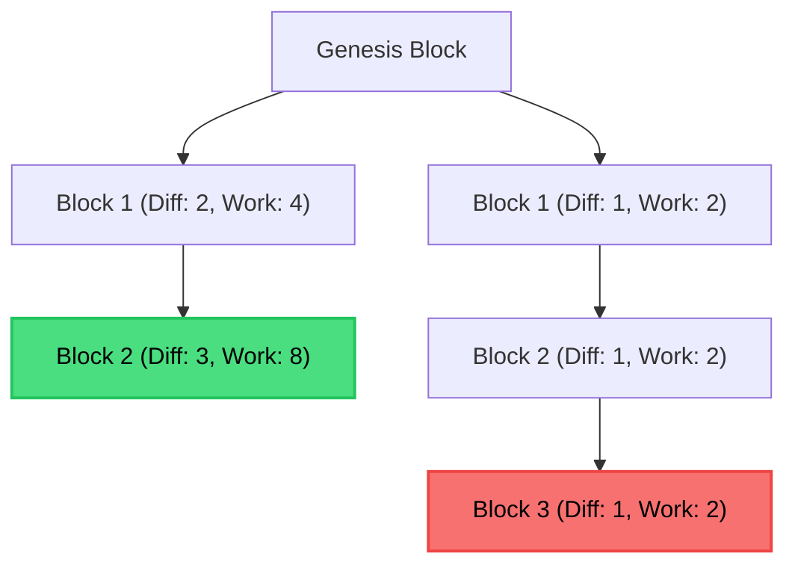
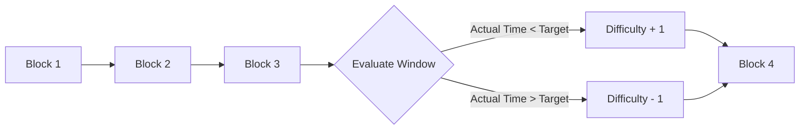
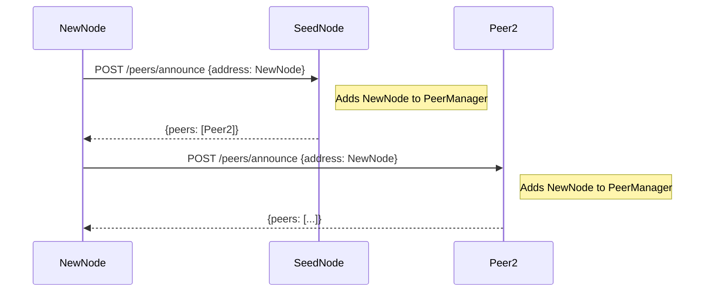
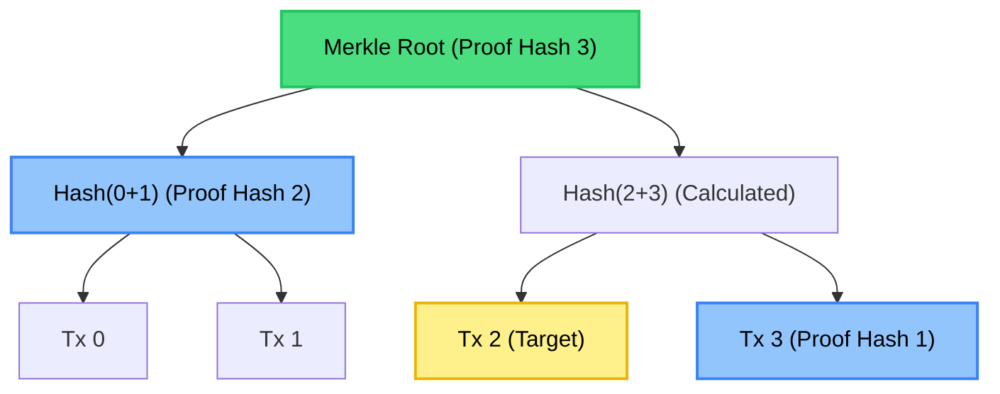

# Phase 5: Consensus and Security

Phase 5 finalizes the core mechanics of the Valence Blockchain by introducing robust consensus rules, dynamic difficulty adjustments, automated peer discovery, and support for Light Clients through cryptographic inclusion proofs.

## 1. The Heaviest Chain Rule (Cumulative PoW)

Previously, the network resolved forks using the "Longest Chain Rule" (i.e., whichever chain had the highest block height won). However, in a network where mining difficulty changes, this is vulnerable to attacks where a malicious miner could quickly mine a long chain of low-difficulty blocks to override the main chain.

To fix this, we migrated to the **Heaviest Chain Rule**. 

*Although the red chain is longer (height 3), the green chain is heavier (Total Work = 12 vs 6) and thus accepted as the truth.*

- The "weight" (or Work) of a single block is calculated as `2 ^ Difficulty`.
- The `CumulativeWork` function (`internal/chain/work.go`) calculates the total work of an entire chain by summing the work of every block.
- When evaluating a fork in `SwitchToChain`, the network now strictly requires the candidate chain to have a higher total cumulative work than the active chain, regardless of its height.

## 2. Network Difficulty Retargeting

To ensure that blocks are mined at a consistent rate (Target Block Time), the network must dynamically adjust the Proof-of-Work difficulty based on the total hashing power of all active miners.

The `CalculateNextDifficulty` function (`internal/chain/retarget.go`) runs every `RetargetWindow` blocks.

- It calculates the **Actual Time** taken to mine the last `RetargetWindow` blocks.
- It compares this to the **Target Time** (`RetargetWindow * TargetBlockTimeSec`).
- If blocks were mined too fast, the difficulty increases by 1.
- If blocks were mined too slow, the difficulty decreases by 1.
- This rule is strictly enforced by `ValidateBlockSlice`. Any block presenting an incorrect difficulty (e.g., a miner trying to artificially lower the difficulty) is immediately rejected by the network.

## 3. Automated Peer Discovery and Pruning

Phase 5 replaces static peer configurations with a fully autonomous, dynamic P2P gossip network.

### The Spiderweb Effect
When a new node joins the network, it only needs to know the address of one "Seed" node.

1. The new node sends a `POST /peers/announce` request to the Seed node, providing its own address.
2. The Seed node adds the new node to its internal `PeerManager` and responds with its entire list of known peers.
3. The new node then asynchronously announces itself to all the newly discovered peers. This chain reaction guarantees that the entire network becomes interconnected very rapidly.

### Health Checks and Pruning
To prevent the network from trying to route messages to offline nodes:
- A background routine pings every known peer via `GET /status` every 60 seconds.
- If a peer fails to respond 3 consecutive times, it is marked as `Failed`.
- Every 30 minutes, a pruning routine permanently deletes all failed peers from memory, saving bandwidth and preventing NAT timeout bottlenecks.

## 4. Merkle Inclusion Proofs (SPV)

To support Mobile Apps and Light Clients, we implemented **Merkle Proofs** (`internal/block/merkle.go`). 
Light Clients cannot download the entire 100GB+ blockchain history just to verify if their single transaction was successful. 

*To prove `Tx 2` is in the block, the node only needs to send `Tx 3` and `Hash(0+1)` (in blue). The light client hashes them together with `Tx 2` to recalculate and verify the root.*

Instead, the Node provides a tiny, mathematically verifiable proof:
- **`BuildMerkleProof`**: Generates a proof array containing only the essential "sibling hashes" required to navigate from the transaction up to the Merkle Root.
- **`VerifyMerkleProof`**: Allows a client to hash their transaction, iteratively hash it with the proof array, and compare the result against the block's Merkle Root. If it matches, the transaction is cryptographically proven to be inside the block.

**Security Consideration (CVE-2012-2459):**
To prevent Second Pre-image attacks (where an attacker manipulates the tree structure to fake proofs), we enforce domain separation:
- Leaf nodes (transactions) are prefixed with `\x00` before hashing.
- Internal tree nodes are prefixed with `\x01` before hashing.
